# Mockups
## Startseite
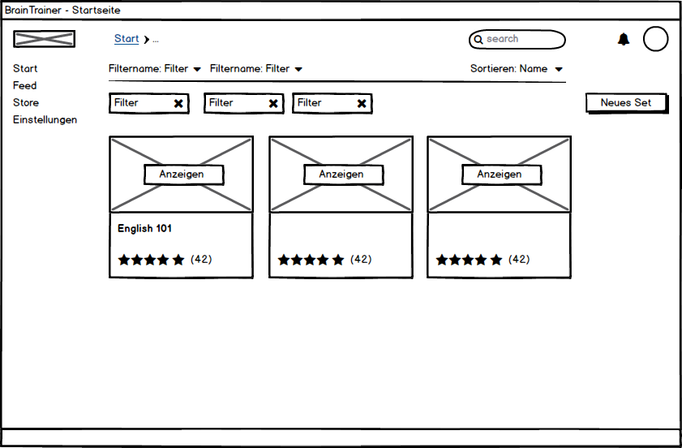

## Feed
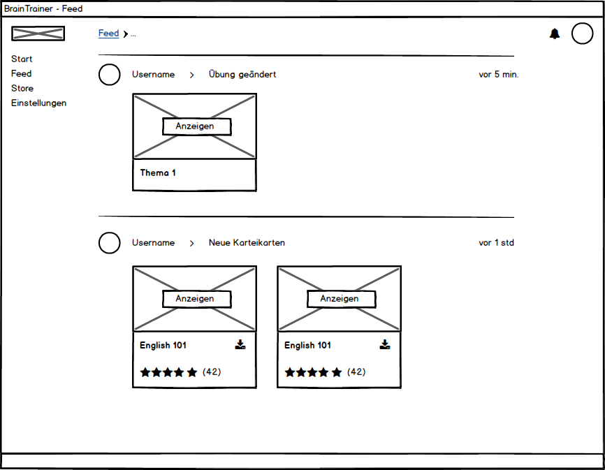

## Einstellungen
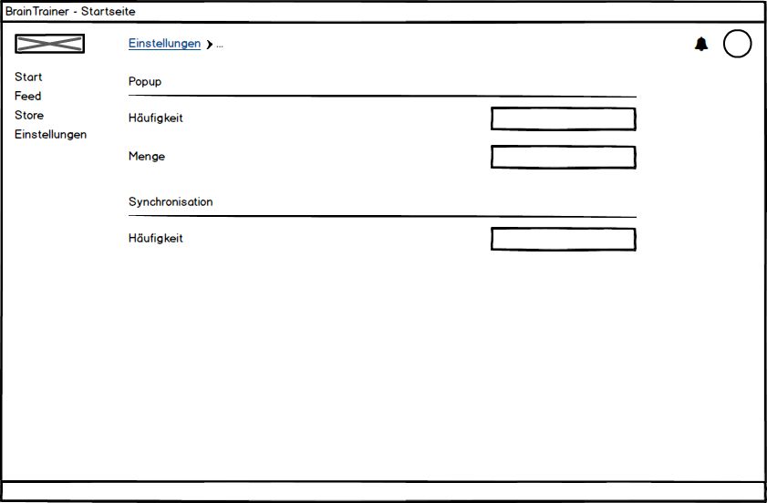

## Store
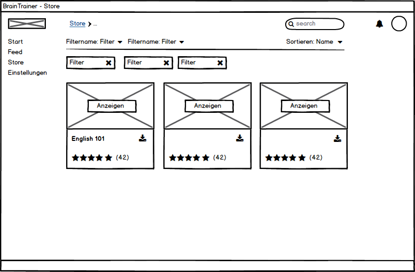

## Login
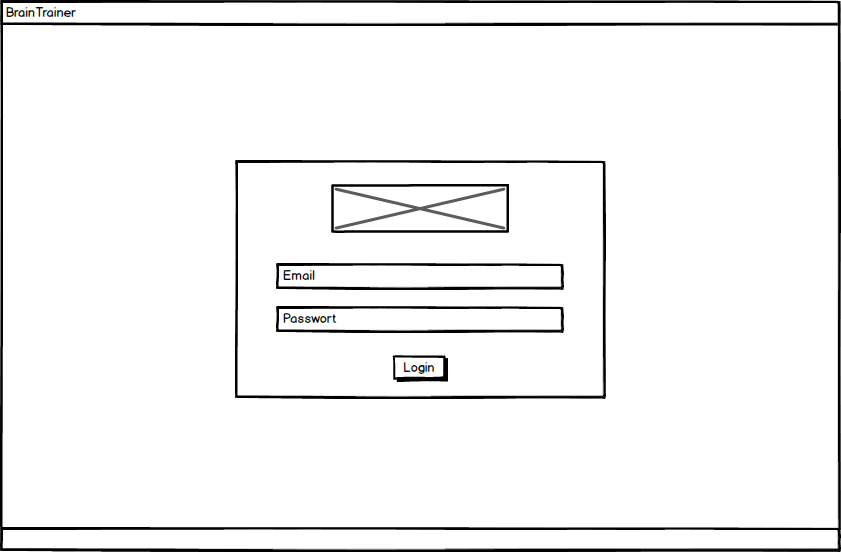

## Profil Sets
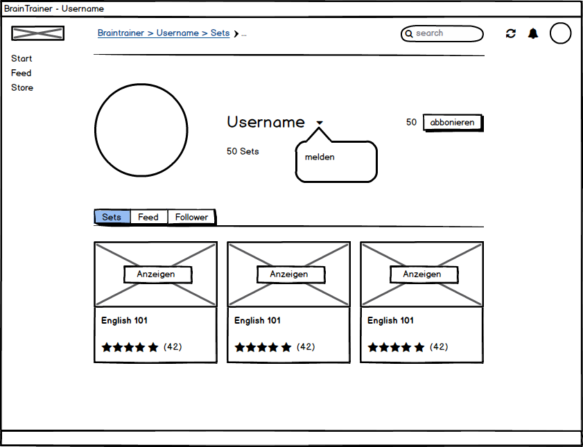

## Profil Feed
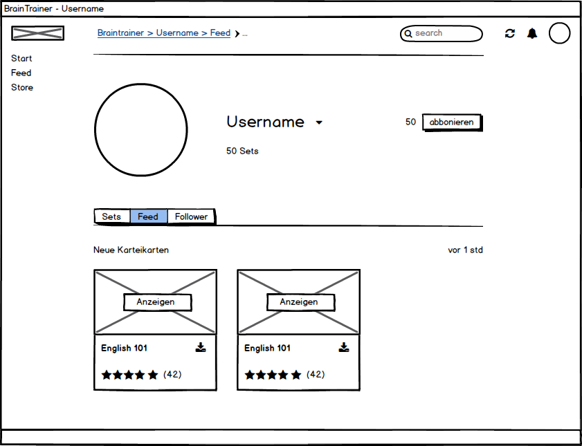

## Profil Follower
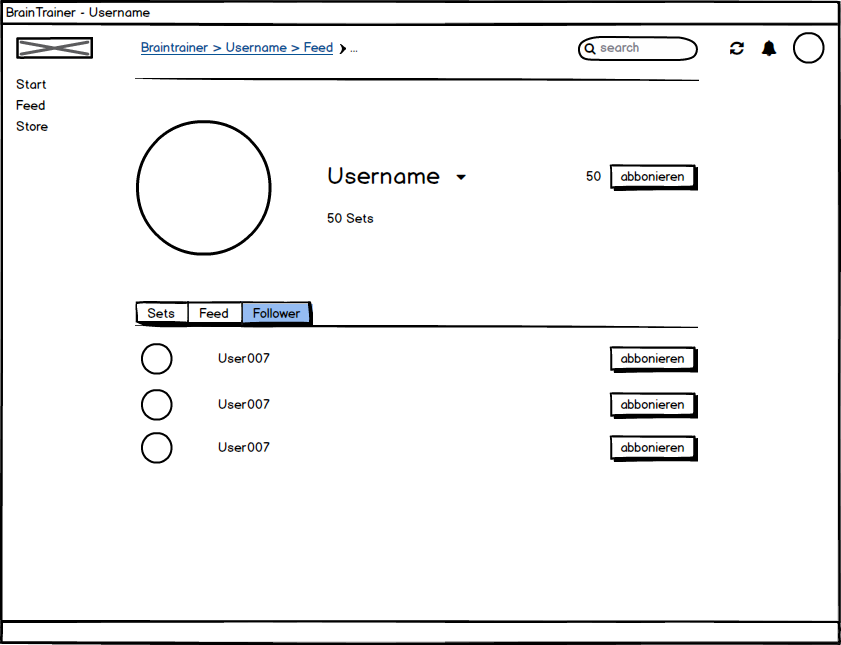

## Karteikarten-Set
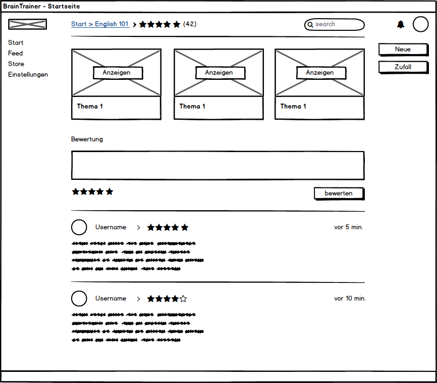

## Karteikarten-Set erstellen
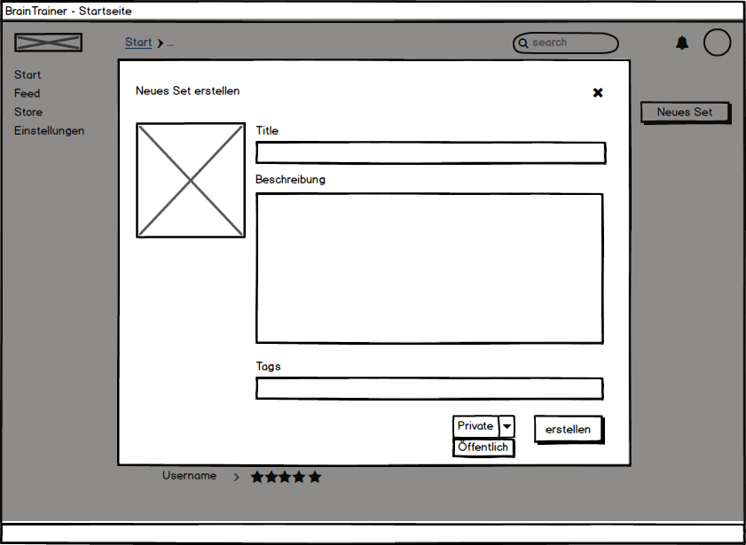

## Karteikarte erstellen
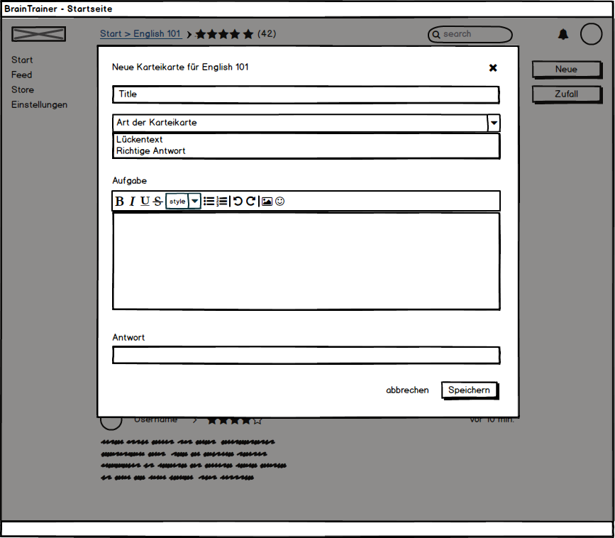

## Karteikarte antworten
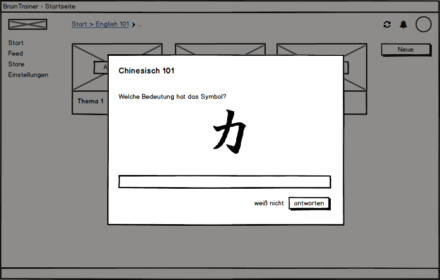

## Tray Popup
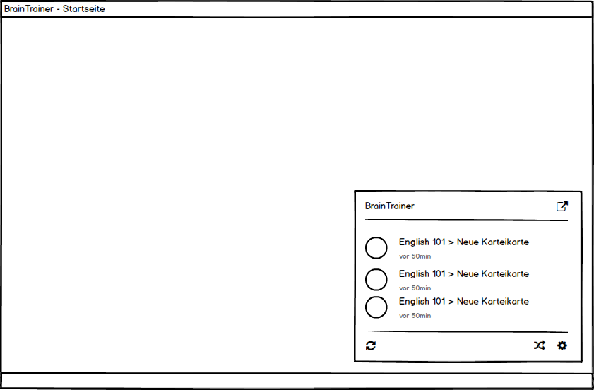

## Tray Answer
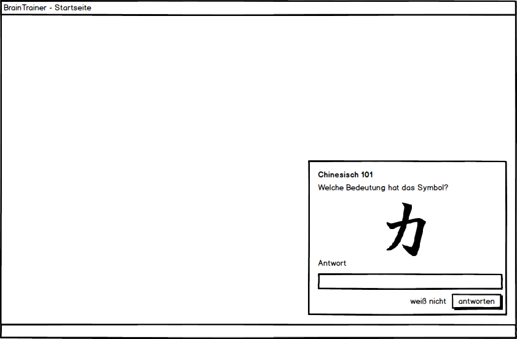

## Tray Einstellungen
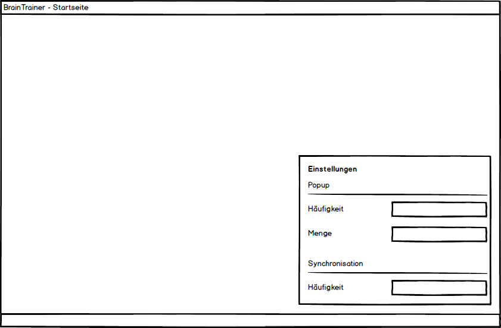

## User Dropdown
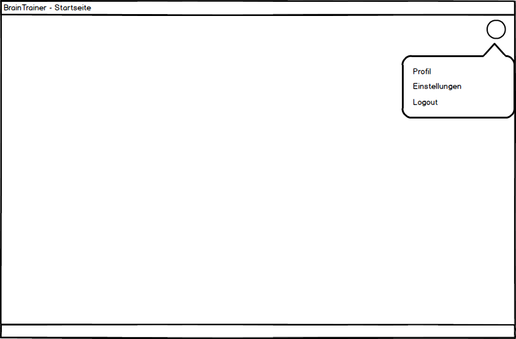
